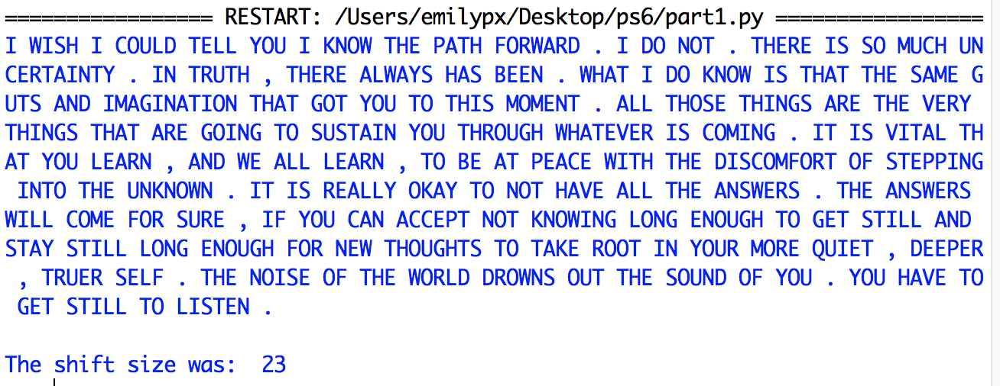

# Problem Set 6

### Due Friday, March 19, 2021, at 11:59pm EST

For this problem set, you will submit to Canvas **a single .zip file**. Detailed instructions for what the .zip file should contain are at the end of this problem set. Note that if you do not submit the files as specified here, there will be a major deduction in your grade for this assignment. Following directions to the letter is a crucial skill for computer programming.

**Structure:** We now have a new component to our programs: **global variables**! Your programs should all have the following format: import statements (if necessary); the global variables (if there are any); then function definitions (if there are any); then a `main()` function that gets the ball rolling and calls the functions you defined (if any); and finally outide all other functions, the call to `main()`.

**C omments:** I now expect you to write comments in your code! Two points will be deducted if you provide no or minimal comments, and 1 point will be deducted if you have sufficient comments but they do not conform to the requirements outlined in PS4.

**Honor pledge**: And, as always, in every program, the first four lines (comments) should be your honor pledge.

---

## Part 1: Caesar cipher: Brute force
In this program, `part1.py`, you will write a program to decode messages written using a [Caesar cipher](https://en.wikipedia.org/wiki/Caesar_cipher). 
The Caesar cipher is named after Julius Caesar, who, according to Suetonius, used it to protect messages of military significance. The Caesar Cipher is a type of substitution cipher in which each letter in a text is replaced by a letter some fixed number of positions down the alphabet. For example, with a right shift of 3, A would be replaced by D, B would become E, and so on until W becomes Z; when the end of the alphabet is reached, the cipher wraps around to the front of the alphabet, so X would be replaced by A, Y by B, and Z by C. 

The Caesar cipher is a very popular thing to assign as a problem set for CS1 so you will find lots of solutions on the internet. The only acceptable solution for this class will be one that conforms to the the specific requirements stated in this problem set description, below. In particular, you cannot use the Python `chr()` and `ord()` or the `translate()` and `maketrans()` string functions.

For this program, I have given you some starter code, which you'll find in the `part1.py1` file in this directory. The information here is included (with different wording) in the comments in the code. **Keep all of your files in the same folder!**

### Global Variables
* `alphabet`: a string set to `ABCDEFGHIJKLMNOPRSTUVWXYZ`.
*  `englishwords`: a set containing the top 2000 words in English, which I populate for you.
*  `alpha2num`: a dictionary that you will populate in one of the functions below.

### Functions
* `setenglishdictionary()`: Populates `englishwords`. You do not need to modify this function.

* `setalpha2num()`: This void function populates the `alpha2num` global variable. You will write this code. For each letter in `alphabet` you will make an entry in `alpha2num` that maps that letter to its corresponding index in `alphabet` (e.g., `A`:0, `B`:1). Use a `for` loop.

* `decode(shiftsize, text)`: This function decodes a text by shifting each character. It takes two arguments: (1) `shiftsize` (i.e., the amount to shift the alphabet) and (2) `text` (i.e., the text you want to decode). It should loop through the input text, and for each character, it should figure out what the replacement character is using `shiftsize` and the global variables `alphabet` and `alpha2num`. The challenges here are: (1) how to make sure that you don't try to look up punctuation marks in `alpha2num` since punctuation is unaffected by the cipher (Ancient Romans didn't use punctuation); and (2) how to wrap over the end of the alphabet. *(Hint: Experiment with the modulus operator!)* This function should return the shifted text as a string.

* `checkgoodness(text)`: This boolean function takes a `text` (a shifted text), splits it into words, then looks each word up in the global variable `englishdictionary`. It keep track of how many of the words in the text are real words that appear in `englishdictionary`. If more than 1/3 of the words in the text appear in `englishdictionary`, then it should return `True`. Otherwise, it should return `False`.

* `bruteforcedecode(text)`: This function submits every possible decoding (i.e., shift) for `text` to `checkgoodness()` until it gets a decoding that `checkgoodness()` decides is likely to be English (i.e., returns `True`). When `checkgoodness()` returns `True`, meaning that there are lots of English words in the text, it returns the shiftsize that worked and the decoded text. 

### `main()` function
I have written the `main()` function for you! You will probably want to modify it as you are developing your code, but make sure to return it back to its original form before you turn in the problem set.

### Practice Texts
I have included 3 encoded texts for you to experiment with. Be sure that I can run your program on all three texts.

### Example Output
Here's what I expect to see as your output when you provide `encoded-message1.txt` as the command line argument:

## Part 2: Caesar cipher: Using statistics

In the last part, you used brute force to solve the Caesar cipher. In this part, you will try to solve the problem more efficiently. Get started by making a copy of `part1.py` called `part2.py`.

---

## What to turn in
If you haven't already, create a `ps6` folder. In your `p6` folder, put all your Python programs. Remove any other things you might have accidentally put in the folder, then zip the folder up using whatever means you normally use to zip things up (e.g., on a Mac, you can right click and select `Compress`).

Upload the `.zip` file you created to Canvas. 

Note that if you do not submit the files as specified here, there will be a major deduction in your grade for this assignment. Following directions to the letter is a crucial skill for computer programming.

**Don't forget your comments!**

### This problem set is due Friday, March 19, 2021, at 11:59pm EST

